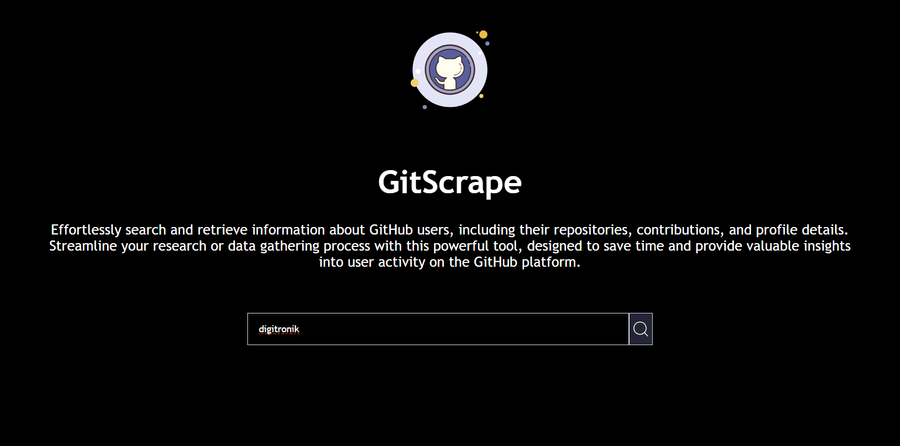
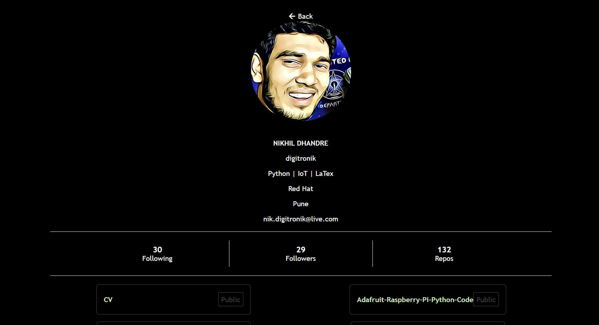
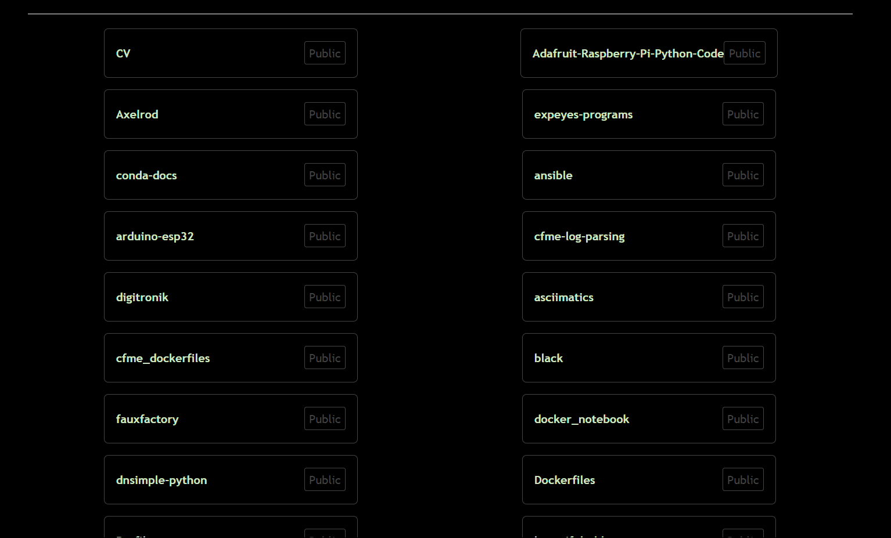
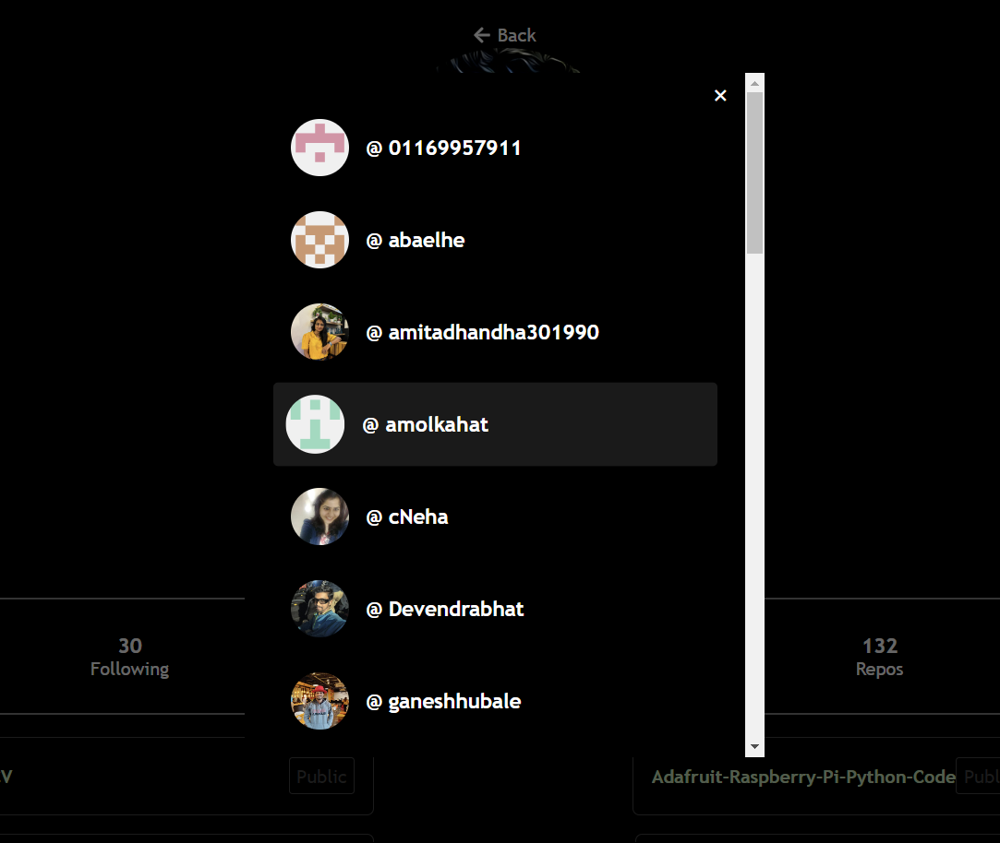
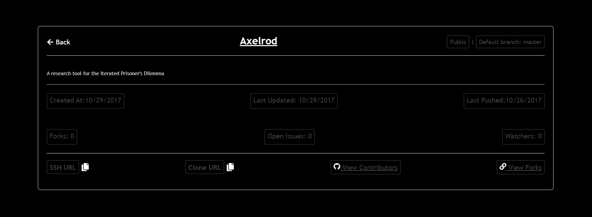

# GitScrape

## Overview
Effortlessly search and retrieve information about GitHub users, including their repositories, contributions, and profile details. Streamline your research or data gathering process with this powerful tool, designed to save time and provide valuable insights into user activity on the GitHub platform.

GitScrape is a full-stack application that uses **Node.js** and **Express.js** on the backend, along with a fully functional frontend client built with **React**. The app utilizes the **GitHub REST API** to fetch GitHub user details and stores them in a local relational database (**MySQL**). It minimizes the number of API calls to GitHub while creating useful endpoints for efficient data retrieval and management.

## Features / Endpoints

1. **Fetch User from DB or Fetch & Save User to DB**: Retrieve a user's information from the database, or fetch it from GitHub and save it locally if not found.
2. **Sorted Users from DB**: Retrieve users from the database sorted based on various parameters (e.g., name, contributions).
3. **Search Users from DB**: Search for users based on various parameters (e.g., username, location, number of repositories).
4. **Fetch User's Followers Details**: Retrieve details about a user's followers.
5. **Find User's Friends**: Identify users who follow and are followed back by the given user.
6. **Update User Details in DB**: Update a user's details in the local database.
7. **Soft Delete User from DB**: Mark a user as deleted without permanently removing their data.
8. **Hard/Force Delete User from DB**: Permanently remove a user and their data from the database.

## Technologies/Frameworks Used

- **Backend**: Node.js, Express.js
- **Frontend**: React.js
- **Database**: MySQL
- **ORM**: Sequelize
- **API**: GitHub REST API

## Frontend Page Snapshots

1. **Home Page**  
   

2. **User Page**  
   
   

3. **Followers Page**  
   

4. **Repository Page**  
   


## Setup Instructions

1. Clone the repository:
   ```bash
   git clone https://github.com/yourusername/gitscrape.git
2. Install backend dependencies:
   ```bash
   git clone https://github.com/yourusername/gitscrape.git
3. Install frontend dependencies:
   ```bash
   git clone https://github.com/yourusername/gitscrape.git
4. Set up MySQL and configure the .env file with your database credentials and GitHub API token.
5. Run the application:

   - Backend: 
   ```bash
   npm run start
   ```
   - Frontend: 
   ```bash
   npm start
   ```
## Contribution:
Feel free to fork the repository and submit pull requests with improvements or bug fixes.

## Contact
Munesh Kumar
